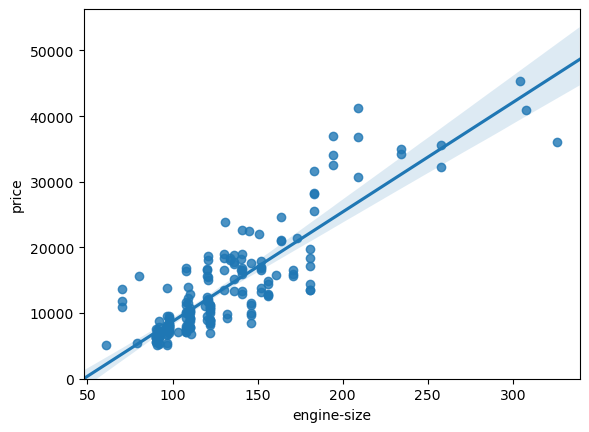
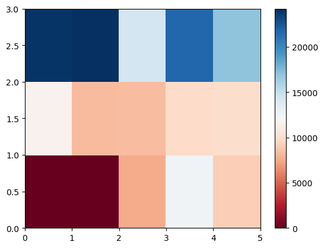
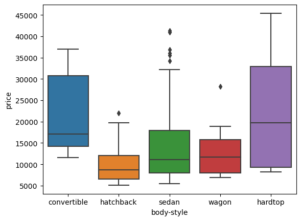

# 🚗 Automobile Data EDA & Analysis


> A data-rich exploratory data analysis (EDA) project focused on a car dataset. This notebook walks through key steps in cleaning, processing, and visualizing automobile data, as well as performing correlation analysis and feature engineering for potential predictive modeling.

---

## 📊 Project Overview

This project performs an in-depth exploratory analysis on an automobile dataset. It aims to:
- Clean and prepare the dataset
- Visualize various relationships using Seaborn and Matplotlib
- Engineer new features such as `city-L/100km` and `horsepower-binned`
- Perform basic correlation and statistical tests to understand feature relevance

---

## 🧰 Tech Stack

- 🐍 Python 3.8+
- 📦 pandas, numpy, scipy
- 📉 seaborn, matplotlib

---

## 📁 Project Structure

```bash
automobile-data-eda/
├── automobileEDA.ipynb        # Main notebook
├── requirements.txt           # Python dependencies
├── wordcloud.png              # WordCloud of popular terms (optional)
├── confusion_matrix.png       # Confusion matrix (if model is used)
├── dataset.csv                # Car dataset used (or linked externally)
└── README.md                  # This documentation
```

---

##🚀 Getting Started
1.Clone the repository

```bash
git clone https://github.com/yourusername/automobile-data-eda.git
cd automobile-data-eda
```

---


2.Install required dependencies
We recommend using a virtual environment:

```bash
pip install -r requirements.txt
```

---

3.Open the notebook

```bash
jupyter notebook automobileEDA.ipynb
```

## 📌 Key Features

- 📦 **Data Import & Inspection**
- 🧹 **Missing Value Handling**
- 📐 **Feature Engineering** (e.g., `city-L/100km`, `horsepower-binned`)
- 📈 **Correlation Matrix & Statistical Tests**
- 🎨 **Seaborn/Matplotlib Visualizations**

---

## 🧪 Example Outputs

### Sample Data

| make         | body-style | horsepower | price   |
|--------------|------------|------------|---------|
| alfa-romero  | convertible| 111.0      | 13495.0 |
| audi         | sedan      | 102.0      | 13950.0 |

### Sample Visualization

<table>
  <tr>
    <td></td>
    <td></td>
  </tr>
  <tr>
    <td align="center">Seaborn Pairplot</td>
    <td align="center">Correlation Heatmap</td>
  </tr>
  <tr>
    <td colspan="2" align="center"></td>
  </tr>
  <tr>
    <td colspan="2" align="center">Boxplot of Numerical Features</td>
  </tr>
</table>

> Visualizations such as pairplots, heatmaps, and boxplots help explore data relationships and detect trends or anomalies.


---

## 📖 Preprocessing Steps

- ✅ Conversion of categorical values
- ✅ Normalization and scaling of numerical features
- ✅ Feature extraction like fuel efficiency and power buckets
- ✅ Dropping irrelevant columns

---

## 📜 License

This project is open-source and available under the **MIT License**.

---

## 🙌 Acknowledgments

Thanks to the **IBM Developer Skills Network** and the open-source Python data science community for providing the dataset and inspiration.

---

## 📫 Contact

If you have any questions or feedback, feel free to reach out:

📧 **akhilsai96@gmail.com**
